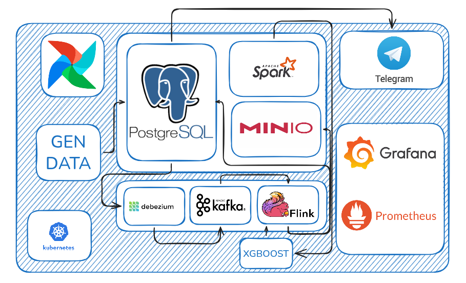
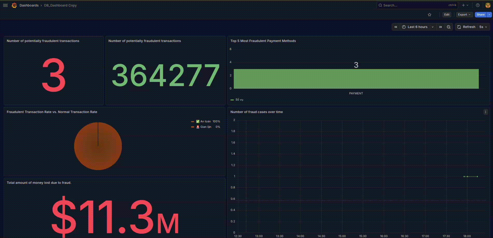
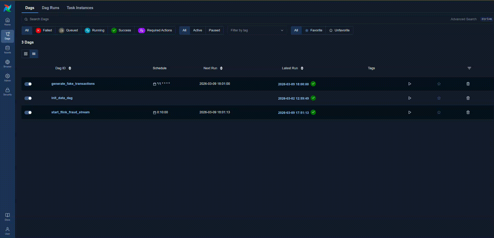

# 📊 Real-time Data-driven Commercial Transaction Identification


> **Project:** Real-time Architectural Analysis and Fraud Prediction System  
> **University:** Ho Chi Minh City Open University (HCMOU)  
> **Tech Stack:** PyFlink, Apache Kafka, Apache Airflow, PostgreSQL, Prometheus & Grafana

J-DataPipe is a comprehensive Data Platform that seamlessly integrates real-time stream processing with advanced predictive analytics. The system leverages an integrated XGBoost model to provide high-accuracy value forecasting and anomaly detection.

---

## 📋 Table of Contents

- [Repository Structure](#-repository-structure)
- [High-level System Architecture](#-high-level-system-architecture)
- [Prerequisites](#-prerequisites)
- [Installation & Setup](#-installation--setup)
- [Running the Application](#-running-the-application)
- [Monitoring & Observability](#-monitoring--observability)
- [Demo Video](#-demo-video)

---

## 📂 Repository Structure

```bash
.
.
├── assets/                         # 🎨 Tài nguyên đa phương tiện
│   ├── images/
│   │   └── architecture.png        # Sơ đồ kiến trúc tổng thể của hệ thống
│   └── videos/                     # Video demo vận hành (FastAPI, Grafana)
│
├── Dags/                           # 🌬️ Apache Airflow Orchestration
│   ├── fake_transaction.py         # DAG tự động tạo & bơm dữ liệu giả vào Kafka
│   ├── init_data.py                # DAG khởi tạo dữ liệu mẫu cho Postgres/MinIO
│   └── start_flink.py              # DAG điều khiển và giám sát trạng thái Flink Job
│
├── FlinkData/                      # ⚙️ Real-time Processing (PyFlink)
│   ├── fraud_model.json            # Trọng số mô hình XGBoost đã được train
│   ├── fraud_prediction.py         # Script xử lý dòng (Stream) & dự báo gian lận
│   └── init.sql                    # Định nghĩa bảng (DDL) cho Flink SQL Connector
│
├── infra/                          # 🏗️ Infrastructure as Code (Kubernetes)
│   ├── airflow/
│   │   └── override-values.yaml# Cấu hình tùy chỉnh cho Helm Chart Airflow
│   ├── flink/                      # Cấu hình cụm Flink (JobManager, TaskManager)
│   │   ├── deployment.yaml
│   │   ├── flink-config.yaml       # Biến môi trường và cấu hình vận hành Flink
│   │   ├── taskmanager.yaml        # Định nghĩa tài nguyên xử lý của TaskManager
│   │   └── ui-jobmanager.yaml      # Service mở cổng Web UI cho Flink (30081)
│   ├── kafka/                      # Hệ thống truyền tin (Strimzi/Kafka-on-K8s)
│   │   ├── connect.yaml            # 🔌 Cấu hình Kafka Connect Cluster - Nền tảng để chạy các bộ kết nối (Connectors)
│   │   ├── kafka-kraft.yaml        # 🚀 Cấu hình Kafka KRaft mode
│   │   ├── kafka.yaml              # 🛠️ Định nghĩa Cluster Kafka
│   │   ├── nodepool.yaml           # 🏗️ Quản lý nhóm các Node trong Kafka, giúp tách biệt vai trò Controller và Broker
│   │   └── postgres-connect.yaml   # 📥 Sink Connector: Tự động đẩy dữ liệu từ Kafka Topic vào PostgreSQL (Database)
│   └── postgres/                   # Database lưu trữ kết quả cuối cùng
│       └── postgres-hive-db.yaml
│
├── models/                         # 🧠 Machine Learning Development
│   └── training.py                 # Script huấn luyện mô hình XGBoost từ dữ liệu thô
│
├── scripts/                        # 🛠️ Database & Automation Scripts
│   └── create_db.sql               # Khởi tạo Schema và bảng cho PostgreSQL
│
├── script.sh                       # 🚀 Master Script: Cài đặt toàn bộ hệ thống 1-click
├── Dockerfile                      # Đóng gói môi trường thực thi (v7, v8...)
├── README.md                       # Tài liệu hướng dẫn chi tiết
```

---

## 🏗 High-level System Architecture



### 1. Orchestration & Ingestion

- **Apache Airflow:** Orchestrates data pipelines, managing data flow from sources (Data Generation) to centralized storage systems.

### 2. Hybrid Data Storage

- **Data Warehouse (PostgreSQL):** Stores structured data to support rapid analytical queries and business intelligence.

### 3. Real-time Streaming

- **Debezium (CDC):** Implements Change Data Capture to track and extract real-time data modifications from PostgreSQL.
- **Apache Kafka:** A high-throughput message queuing system that decouples and coordinates data streams between services.
- **Apache Flink:** Performs low-latency, stateful stream processing for real-time analytics and transformations.

### 4. AI & Prediction Layer

- **XGBoost:** Executes predictive modeling and real-time inference based on processed data features delivered by the pipeline.

### 5. Monitoring & Observability

- **Prometheus:** Collects performance metrics across the entire Kubernetes infrastructure in real-time.
- **Grafana:** Provides comprehensive visualization of system performance through interactive, real-time dashboards.

---

# 🔧 Prerequisites

To run the **J-DataPipe** project locally, ensure your machine meets the hardware requirements and has the following tools installed:

### 🖥️ Hardware Recommendations

Because the pipeline runs multiple heavy-duty services (Kafka, Flink, Airflow, and Monitoring), your system should ideally have:

- **CPU:** 4+ Cores
- **RAM:** 16GB (Minikube requires at least **8GB** dedicated to the cluster)
- **Disk:** 20GB free space

### 🛠️ Required Tools

| Tool               | Description                                                                      | Download / Guide                                                 |
| :----------------- | :------------------------------------------------------------------------------- | :--------------------------------------------------------------- |
| **Docker Desktop** | Essential container runtime to build images and host the Minikube node.          | [Download Here](https://www.docker.com/products/docker-desktop/) |
| **Minikube**       | Local Kubernetes cluster orchestrator.                                           | [Installation Guide](https://minikube.sigs.k8s.io/docs/start/)   |
| **Kubectl**        | The standard CLI tool for interacting with the Kubernetes API.                   | [Install Kubectl](https://kubernetes.io/docs/tasks/tools/)       |
| **Helm v3**        | K8s Package Manager used for deploying Airflow and the Prometheus/Grafana stack. | [Install Helm](https://helm.sh/docs/intro/install/)              |
| **Python 3.13+**   | Required for local ML training (`models/`) and PyFlink development.              | [Download Python](https://www.python.org/downloads/)             |

---

### ✅ Verification

Run the following commands in your terminal to verify the installation:

```bash
docker --version      # Should be v20.10+
minikube version      # Should be v1.30+
kubectl version --client
helm version
python --version
```

---

## 🕹️ Installation & Setup

```bash
bash script.sh
```

---

## 🎮 Running the Application

### 1. Port Forwarding

Open a new terminal window and run the following command to create a tunnel from your machine to the Kubernetes cluster:

```bash
kubectl port-forward svc/airflow-api-server 8080:8080 --namespace orchestration
# Keep this terminal open while you use the app
```

### 2. Access the Interface

Once the port-forward is running, access the FastAPI Swagger UI by clicking the link below:  
👉 URL: http://localhost:8080  
👉 USER: admin  
👉 PASSWORD: admin

---

## 🖥️ Monitoring & Observability

### 1. Port Forwarding

Open a new terminal window and run the following command to create a tunnel from your machine to the Kubernetes cluster:

```bash
kubectl port-forward svc/monitor-stack-grafana 3000:80 -n monitoring
# Keep this terminal open while you use the app
```

### 2. Access the Interface

Once the port-forward is running, access the FastAPI Swagger UI by clicking the link below:  
👉 URL: http://localhost:3000  
👉 USER: admin  
👉 PASSWORD: (Get from secret):

```bash
kubectl get secret -n monitoring monitor-stack-grafana -o jsonpath="{.data.admin-password}" | base64 --decode
```

### 3. Import dashboard

1. In the Grafana sidebar, go to **Dashboards** -> **New** -> **Import**.

2. Click **Upload JSON file** and select the file located at: **infra/monitoring/grafana-dashboard.json**.

3. Select **PostgreSQL** as the Data Source (ensure you have connected Postgres as a Data Source first).

4. Click **Import**.

---

## 🌊 Data Flow Pipeline

1. **Source:** Fake transaction data is generated by **Airflow** and pushed to **PostgreSQL**.
2. **Ingestion:** **Debezium** captures row-level changes (CDC) from Postgres and streams them into **Kafka** topics.
3. **Processing:** **PyFlink** consumes streams from Kafka, performs feature engineering, and invokes the **XGBoost** model for real-time inference.
4. **Sink:** Results are written back to **PostgreSQL** and visualized instantly on **Grafana**.

---

## 🚢 Demo Video

### Demo dashboard



### Demo airflow


